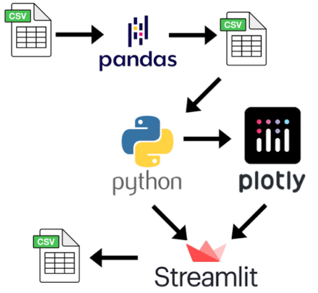
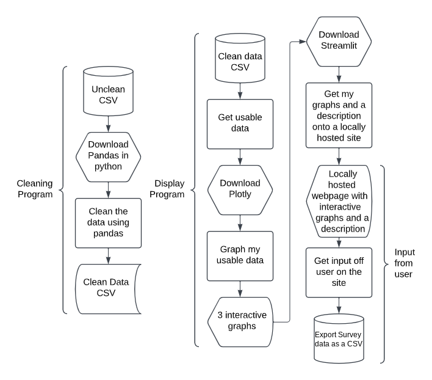
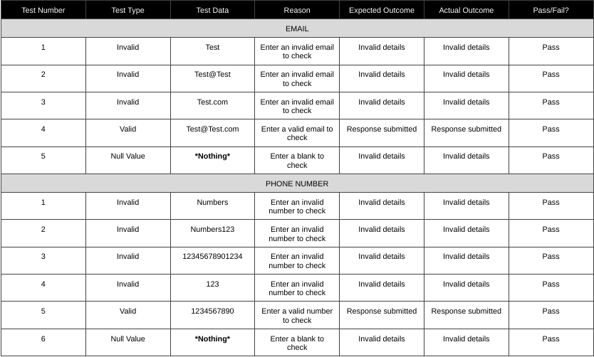

# Student Mental Health Data Analysis
02/06/2025 - 06/07/2025

## Project Overview

This project investigates student mental health using data analysis, data visualisation and an interactive web page. The aim was to explore patterns within a student mental health dataset and present the results in a clear and accessible way. I used Python, Pandas, Plotly and Streamlit to create the project. Pandas was used to clean and prepare the data, Plotly was used to create interactive visualisations, and Streamlit was used to present the analysis through a web page.

## Dataset Research and Selection

I began by researching potential datasets using several sources, including data.gov.ie, the Central Statistics Office, Europa, UCD resources and Kaggle. The main challenge was finding a dataset that was suitable for both analysis and visualisation. Some datasets were already extremely clean and contained very few variables, while others were too large or unstructured for the scope of the project.

I selected the Student Mental Health dataset from Kaggle. I chose this dataset because the dataset contained enough information to support meaningful visualisation while still requiring some data cleaning. The dataset was particularly relevant as I have a personal interest in it, as I myself am just starting college.

## Research into Data Visualisation and UI/UX

Before developing the application, I researched existing data visualisation websites to identify effective approaches to displaying information. I examined examples including Gapminder and applications available through the Streamlit gallery. Gapminder showed how interactive visualisations can allow users to explore complex datasets, while Streamlit examples showed how graphs, datasets and navigation could be incorporated into a web page.

From this research, I identified several design principles that I wanted to incorporate:

* Interactive graphs
* Clear descriptions of the data
* Multiple tabs for navigation
* A simple interface
* Visualisations that were more detailed than basic static charts without becoming unnecessarily complex

I decided to use Streamlit because it allowed me to create a webpage that could display the analysis, visualisations and have user interaction in a single webpage that is locally hosted. I created wireframe diagrams to illustrate the UI/UX I wanted to create.

### Wireframe Diagram 1

### Wireframe Diagram 2

## Technical Architecture

The project used several technologies, each with a specific purpose. The overall workflow can be represented as:

* Clean original CSV file using Pandas
* Read the clean data using python
* Convert the data to usable data
* Graph the data using Plotly
* Display my graphs and descriptions using streamlit
* Take user input from streamlit
* Save user input to CSV file

### Architecture Diagram

## Process Flowchart

## Data Cleaning and Preparation

After selecting the dataset, I used Pandas to prepare the data for analysis. The main cleaning tasks included:

* Standardising text by converting strings to uppercase
* Identifying empty cells
* Filling missing categorical values using the mode
* Extracting the relevant information from the cleaned CSV
* Preparing the data for use with Plotly

These steps were necessary because inconsistent text formatting and missing values can affect grouping, filtering and visualisation. One limitation of this approach is that if I were to redo this project, I would document the number of missing values before and after cleaning so that the impact of the cleaning process could be measured more clearly.

## Exploratory Data Analysis

Once the data had been cleaned, I used Plotly to create interactive visualisations. The purpose of the visualisations was not simply to display the dataset, but to make patterns and differences within the data easier to identify. The interactive approach allowed users to explore the information rather than viewing a fixed set of charts. This was one of the main design objectives identified during the initial research. The project developed through several stages of visualisation, beginning with an initial interactive graph and progressing to additional graphs as the analysis developed.

## Key Findings

The analysis identified an important limitation in the composition of the dataset. The dataset contained substantially more responses from women than men. The report also identified that the average academic performance represented in the dataset appeared higher than expected. This means that the results should not automatically be treated as representative of the wider student population. For example, if one demographic group is substantially overrepresented, patterns identified in the complete dataset may reflect the characteristics of that group more strongly than those of other students. The original analysis identifies the imbalance but does not provide enough statistical detail to quantify its effect. A future version of the analysis would therefore include:

* The number and percentage of respondents in each demographic group
* The distribution of academic performance
* Comparisons between groups
* Sample size for each comparison
* Additional statistical measures where appropriate

## Interactive Dashboard

After preparing the data and creating the visualisations, I developed a Streamlit application to present the results. The application included:

* Interactive graphs
* Descriptions of the data
* Multiple navigation tabs
* A user survey
* Data input and export functionality
* A recommendations section

The use of separate tabs was intended to improve navigation by allowing different parts of the project to be accessed independently. The application therefore acted as both a data visualisation dashboard and an interactive interface for users.

### Sample Graph and Description from Site

### Survey from Site

## User Input and Validation

I also implemented a survey that allowed users to enter information through the application. I tested the form to determine which inputs should be accepted and which should be rejected. For example, the email field was designed to require an email format containing an “@” symbol and “.com”, while the phone number field was tested using numerical input with a defined length range. The survey functionality was subsequently extended using Javascript, and the application was designed to save and export user data to CSV.

## Testing

Testing was carried out throughout the development process.

### Application testing

I tested:

* Form inputs
* Invalid inputs
* Email validation
* Telephone number validation
* Data input
* CSV export
* Website functionality

### Survey input testing

## Development Process

The project was developed incrementally over several weeks. This iterative approach allowed the application to develop alongside the analysis rather than attempting to build the complete system at once.

### Week 1: Dataset research and cleaning

I researched different dataset sources and evaluated their suitability. I selected the Student Mental Health dataset, downloaded it and began cleaning the data using Pandas.

### Week 2: Initial visualisation

I extracted usable data and created the first interactive Plotly visualisation.

### Week 3: Dashboard development

I created additional interactive graphs and began developing the Streamlit application.

### Week 4: Data input

I added Javascript functionality to the survey for user data input and CSV export.

### Week 5: Analysis

I analysed my graphs and wrote the descriptions and analyses on my web page

## Challenges and Problem Solving

One of the main challenges was finding a dataset that was suitable for the project. Some datasets were too large, too small, too unstructured or already so clean that there was limited opportunity to demonstrate data preparation skills. I therefore compared multiple sources before selecting the final dataset.

I struggled with using streamlit, as I had never made an interactive HTML project before, only webpages that would display data. Learning javascript for this project was a challenge, but due to my experience with various coping languages before, I was able to pick it up quickly. I learned shell commands in order to run this site, as streamlit cannot be run in a compiler. There were a few learning curves throughout the process of this project, but through research I was able to solve them without much delay.

## Evaluation of the Analysis

One of the most important lessons from the project was that creating a graph does not necessarily mean that the underlying conclusion is reliable. The dataset contained an uneven representation of genders and appeared to contain a relatively high level of academic performance. These characteristics could affect the patterns observed in the analysis.

This means that the results should be interpreted as findings from this particular sample, rather than automatically being generalised to all college students. A stronger future analysis would investigate:

* Whether the sample is representative
* Whether different demographic groups produce different patterns
* Whether the sample size is sufficient for each comparison
* Whether missing data treatment affects the results
* Whether relationships identified in the data are statistically meaningful

## Recommendations for Future Development

There are several areas where the project could be expanded.

### Improve the statistical analysis

The next version could include more quantitative analysis rather than relying primarily on visual comparisons. For example:

* Descriptive statistics
* Group comparisons
* Correlation analysis where appropriate
* Distribution analysis
* More detailed investigation of demographic differences

### Improve data documentation

I would document:

* Number of records
* Number of variables
* Data types
* Missing values
* Cleaning decisions
* Number of records removed or modified

### Improve visualisation

The dashboard could include additional interactive filters and more detailed visualisations while maintaining a simple user interface.

### Improve the application design

The aesthetics and level of detail of the website could be improved. Future development could focus on:

* Improved layout
* Better navigation
* More informative dashboard summaries
* Improved accessibility
* Clearer explanations of individual charts

## Conclusion

This project allowed me to develop my data analysis skills, from researching and selecting a dataset through to cleaning, visualising and presenting the results in an interactive application. The project demonstrates practical experience with Python, Pandas, Plotly and Streamlit, while also developing skills in data preparation, visualisation, UI/UX design, testing and critical evaluation.

One of the most important outcomes was recognising that the quality of a data analysis depends not only on the visualisation but also on the quality and representativeness of the underlying data. The analysis identified potential sampling limitations, particularly the imbalance between male and female respondents and the distribution of academic performance. These limitations demonstrate why data should be evaluated critically before conclusions are generalised.

For future development, I would focus on expanding the statistical analysis, documenting the data cleaning process more thoroughly, improving the dashboard design and providing more quantitative evidence for the project's findings and recommendations.

Overall, the project provided experience across the full data analysis lifecycle and gave me a practical foundation for developing more advanced data analysis and visualisation projects.
